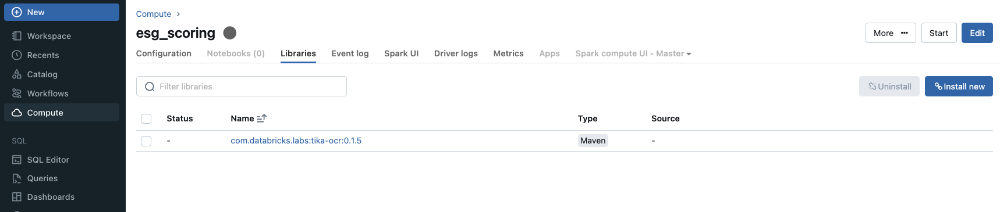
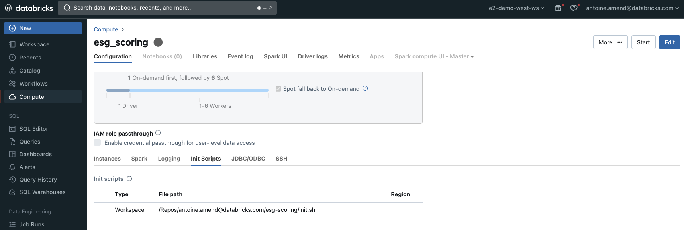
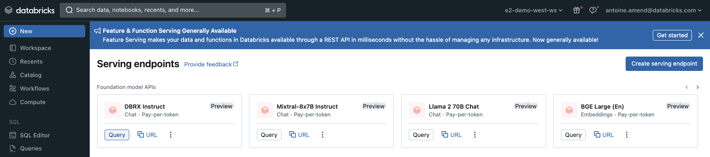

# Run me

This solution is made of 3 notebooks. 

## CSR download
Given a synthetic portfolio (stored as json file on config folder), we download raw CSR reports from responsibilityreports.com that we store on a given volume (dictated by your config file). We use [Tika-OCR library from databricks labs](https://github.com/databrickslabs/tika-ocr) to read and process unstructured documents. 

Please ensure you installed [library](https://mvnrepository.com/artifact/com.databricks.labs/tika-ocr) as a maven dependency to your cluster

We recommend leveraging tesseract binaries since text might be included in pictures. This can be done using [init](init.sh) script at cluster startup.

## CSR scoring
We extract dominant topics from CSR reports using simple LDA model fine tuned with hyperopts. We make use of DBRX model for naming each topic. Please ensure foundational model API is available on your workspace. 

## GDELT download
We want to enrich our ESG scoring strategy with alternative dataset provided by GDELT. While preliminary version of this solution was downloading news events from GDELT website, the same is now available on [marketplace](https://marketplace.databricks.com/details/a9845406-f523-42fa-abe9-9137ebcd0406/The-GDELT-Project_GDELT-10-Global-Knowledge-Graph-GKG). Adding this dataset will create a dedicated catalog / schema that must be reported in your configuration file.  