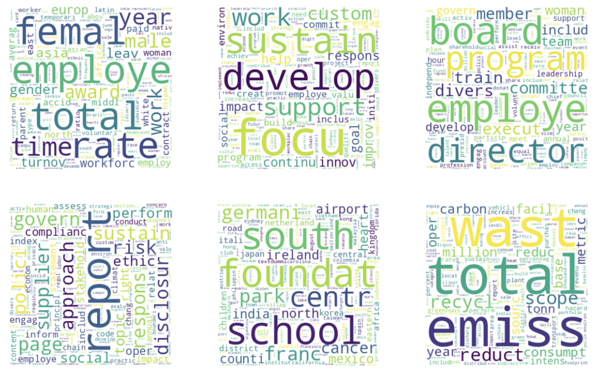
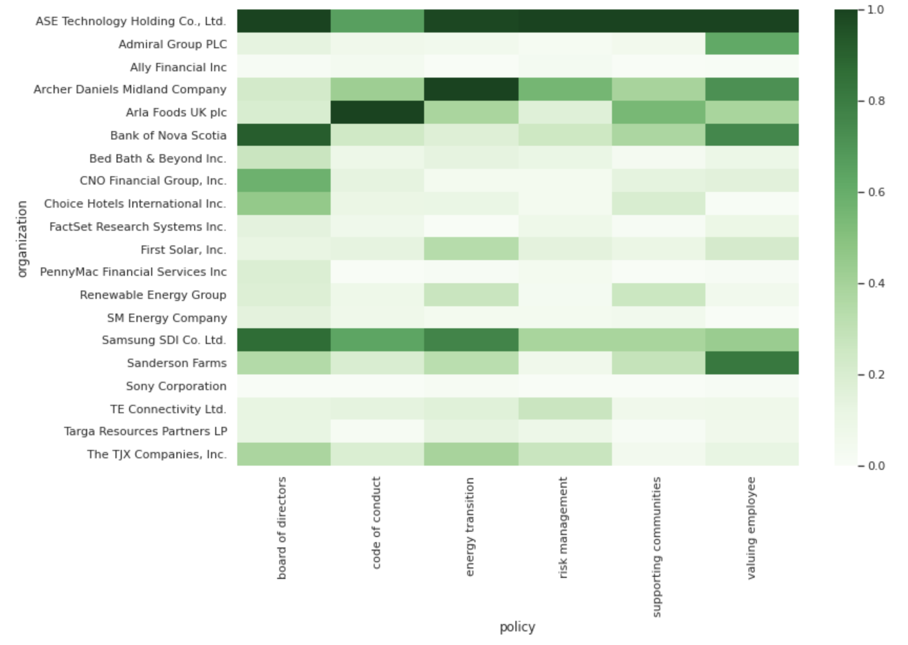
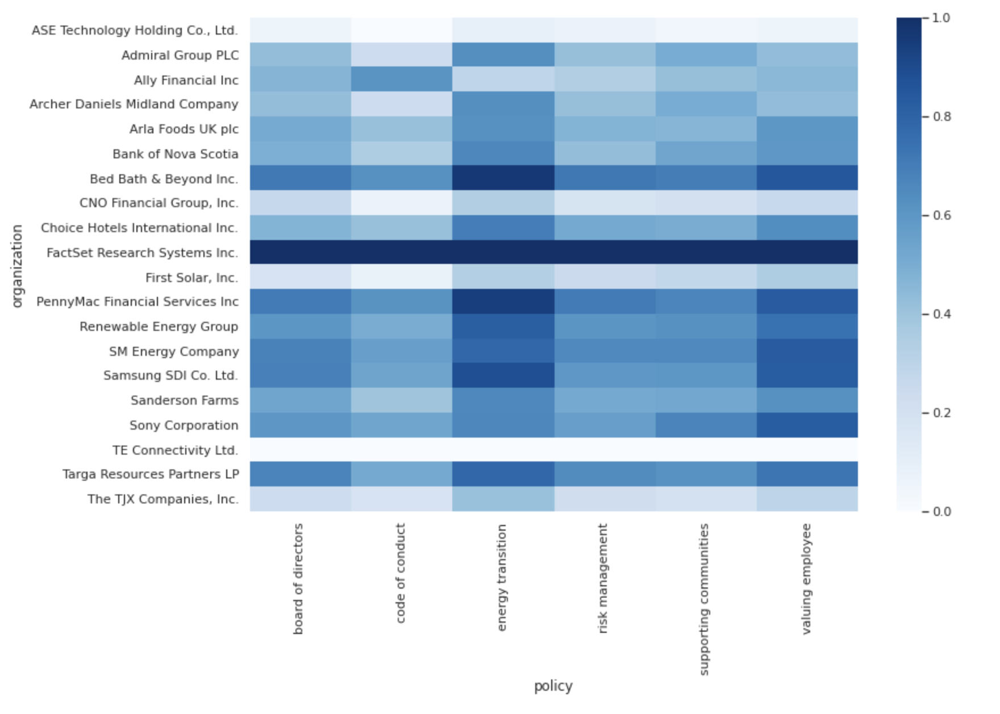
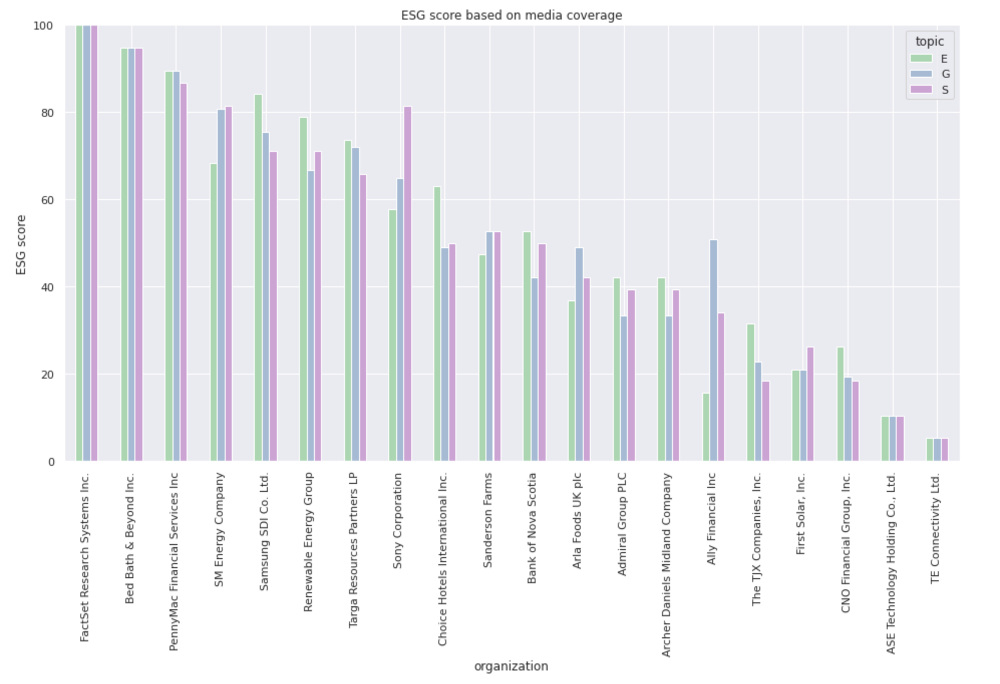
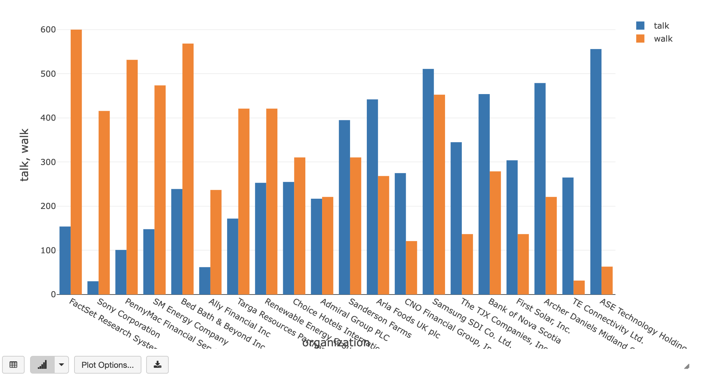

# User Guide

This guide walks you through the configuration and execution of the ESG solution accelerator for GCP environment.
Based on previous implementations, we estimate the time for an overall POC duration to be around 5 days.

## [00_configure_notebook](config/configure_notebook.py)

Although executed through multiple notebooks, this solution is configured using external configuration file. 
See [application.yaml](config/application.yaml) for more information about each configuration item. 
This configuration will be used in [configure_notebook](config/configure_notebook.py) and 'injected' in each notebook 
as follows. Please note that the portfolio used in that POC is provided as an external [file](config/portfolio.txt) 
and accessible through the configuration variable `portfolio`. In real-life scenario, this would be read from an 
external table or as job argument. 

```
%run config/configure_notebook
```

## [01_csr_download](./01_csr_download.py.py)

### Download CSRs

You will need to support outbound HTTP accesses from your databricks workspace. 
Although having a central place where to source data from minimizes the amount of firewall rules to enable, this 
approach comes at a price: it prevents user from distributing that scraping logic across multiple executors. 
We download data sequentially, checkpointing to delta every `config['csr']['batch_size']` PDF documents. 
Just like many web scraping processes, please proceed with extra caution and refer to website 
[T&Cs](https://www.responsibilityreports.com/Disclaimer) before doing so.

## [02_csr_scoring](./02_csr_scoring.py)

### Text preprocessing

As our process runs in a distributed manner, please ensure each executor is able to retrieve our NLTK pre-trained 
pipeline from disk. NLTK was previously downloaded through the configuration [notebook](config/configure_notebook.py) 
and stored on a mounted disk accessible by each executor as-is.

```python
@pandas_udf('string')
def lemmatize_text_udf(batch_iter: Iterator[pd.Series]) -> Iterator[pd.Series]:
  load_nltk(nltk_path) # loading pre-trained pipeline once per executor
  for xs in batch_iter:
    yield xs.apply(lemmatize_text)
```

### Hyperparameter tuning

We use `hyperopt` to fine tune our LDA model (specifically the number of topics to learn), capturing each experiment on 
MLFLow. Process should take 15mn to complete depending on the amount of data to learn from. We maintain as much possible
consistency across different runs by specifying our `rstate` parameter. Please note however some breaking changes
existing against different versions of `hyperopt` (hence across different runtimes). This logic is handled in our 
configuration [notebook](config/configure_notebook.py)

```python
import hyperopt
import numpy as np
if hyperopt.__version__.split('+')[0] > '0.2.5':
  rstate=np.random.default_rng(123)
else:
  rstate=np.random.RandomState(123)
```

### Interpreting results

We use simple `wordcloud` visualization for that purpose. Please note that different setup and different data will yield 
different results that must be **manually investigated**.



### Name ESG topics

Domain experts would be able to map the above to existing ESG policies or internal strategic initiatives. For the purpose
of that POC, we simply hardcode topic names that we persist onto both a delta and big query table. In real-life 
scenario, domain experts would rename topics on a table through SQL commands.

```python
topic_df = pd.DataFrame([
  [0, 'S', 'valuing employee'],
  [1, 'G', 'code of conduct'],
  [2, 'G', 'board of directors'],
  [3, 'G', 'risk management'],
  [4, 'S', 'supporting communities'],
  [5, 'E', 'energy transition']
], columns=['id', 'topic', 'policy'])
```

### Comparing organisations

Given our portfolio items defined in our external [file](config/portfolio.txt), we display each company side by side
against each of our defined topics (previously labelled through domain expertise). That visualization brings bear to our
first actionable insight. How much more does company A communicates about topic T? The more descriptive and the more
frequent each topic is within a given PDF, the more "green" that particular cell is. 



### Registering model

This section takes the model we learned at previous steps and make it generic enough to be used outside the scope of 
that particular notebook. We package our LDA pipeline as a `pyfunc` model that we register on MLFlow alongside required 
dependencies for model serving capability. In order to make our solution turn key ready, we register our model on ML Registry under `Staging` tag, archiving any
previous instances of a same model. 

```python
client = mlflow.tracking.MlflowClient()
client.transition_model_version_stage(
    name=model_name,
    version=version,
    stage='Staging'
)
```

### CSR score

In that last section, we tie those insights together to create a basic score that captures the communication coverage 
from CSR disclosure. We only visualize organizations in our [portfolio](config/portfolio.txt), though we've stored
all public organization to a delta table.


## [03_gdelt_download](./03_gdelt_download.py)

### News dataset

Supported by Google Jigsaw, GDELT datasets are available on Google BigQuery (see GCP branch) and flat files with new increment available every 15mn.
Please be mindful of the data available as the entire dataset is around 2Tb and spans over 50 years. 

```python
from utils.gdelt_download import download
max_date = datetime.today()
min_date = max_date - timedelta(hours=1)
download(min_date, max_date, config['gdelt']['raw'])
```

### Organization contribution

These next couple of sections may be quite confusing but pivotal to ESG solution success. Given the low signal / noise
ratio of news analytics, we create a simple weighting strategy to attribute the impact of a new relative to its 
organization coverage. Using NLP, we extract each mention of an organization from their CSR disclosure. 
Similar to NLTK pipelines, we load spacy library and pre-trained pipelines through a `pandas_udf` as follows

```python
@pandas_udf('array<string>')
def extract_organizations_udf(content_series_iter: Iterator[pd.Series]) -> Iterator[pd.Series]:
  nlp = load_spacy(spacy_path)  # loading pre-trained pipeline once per executor
  for content_series in content_series_iter:
    yield content_series.map(lambda text: extract_organizations(text, nlp))
```

### Media contribution

Some organizations may be mentioned more than others and will be normalized through simple term frequency / inverse 
document frequency techniques (TF-IDF). 

### Media coverage

We can join both organizations and media contribution to better understand the impact one given news may have to the 
organizations it mentions. We save each matching news alongside organization contribution to a delta table 
`config['database']['tables']['gdelt']['bronze']`.

## [04_gdelt_scoring](04_gdelt_scoring.py)

### ESG scoring

We categorize each news title against our key topics extracted earlier. As model yields a probability distribution,
we extract the actual topic ID and topic probability as tuple using a schematized `udf`, saving our results to a delta
table.

```python
schema = ArrayType(StructType([
    StructField("id", IntegerType(), False),
    StructField("probability", FloatType(), False)
]))
 
@udf(schema)
def with_topic(ps):
  return [[i, p] for i, p in enumerate(ps)]
```

### ESG coverage

By aggregating news events for each organization and each topic, and by applying our contribution factor as explained
above, we can simply visualize our portfolio coverage through a simple heatmap. The more positive news articles 
(and the more frequent) are related to a given topic, the more "blue" each cell is.



### ESG scores

Using simple `window` partitioning, we rank our organizations based on media coverage and media sentiment using our
contribution factor. We display our organizations scores on a simple bar chart.



### Walking the talk

Finally, we join our 2 scores together (the one derived from our CSR and the one from GDELT) into one simple 
visualization representing the over-communication or under-communication to look out for.



# Issues

For any issue, please raise ticket to github project directly.
